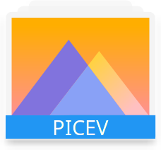
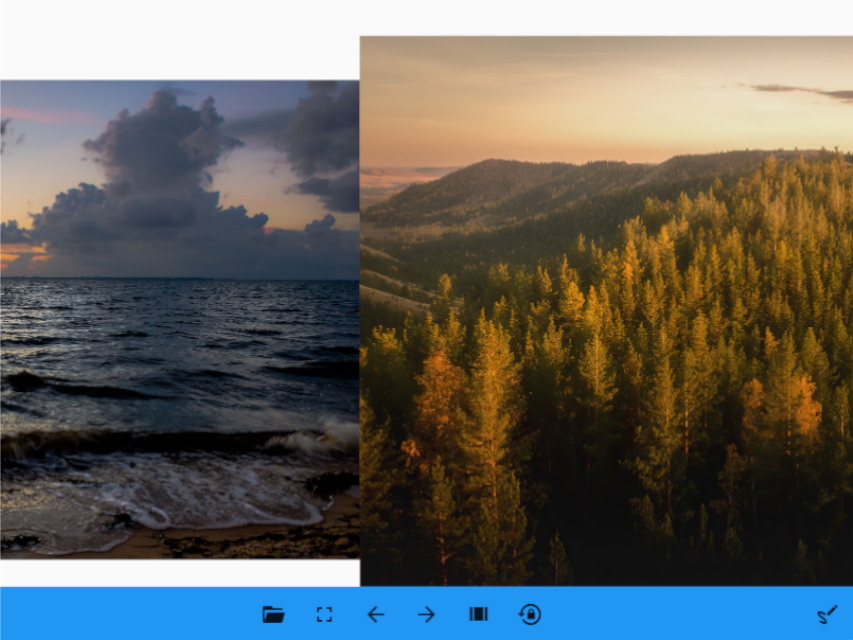
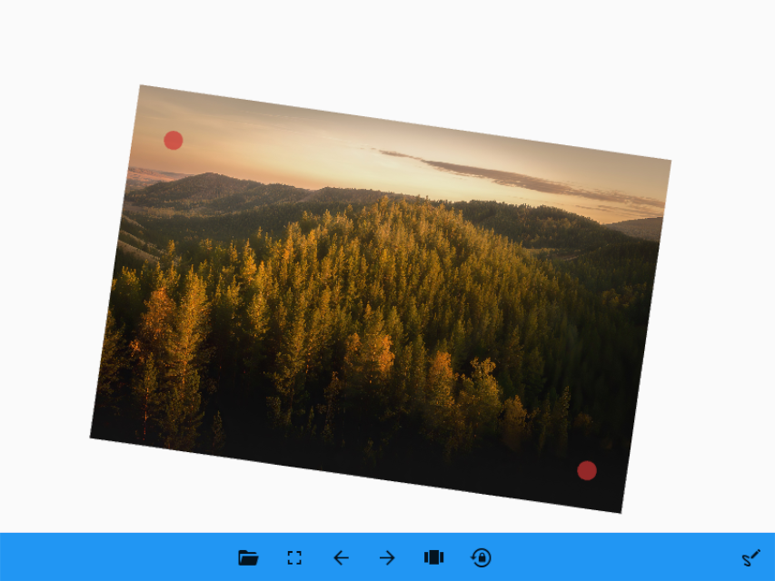

# Picev

A Simple KivyMD Photo Viewer

## Requirements

- kivymd
- kivy
- Xlib

#### Install All Using

      pip install --upgrade kivymd kivy xlib

#### Clone Then Run the beta Version

      git clone https://github.com/NadjibC/Picev.git
    
      cd Picev
    
      python main.py

## Screenshots

### - Carousel Mode : Look to your picture with animation

------------------------------------------------------------------------------------------------------------------------------

## - Scatter Mode : Rotate & Resize Your Image

## (To Turn On This mode : right-click on image)

